# docker简介
Docker是一个开源的引擎，可以轻松的为任何应用创建一个轻量级的、可移植的、自给自足的容器。可以将一个应用或者整个系统打包到docker容器里面，实现快速部署和运行。

## docker和虚拟机的区别
虚拟机是通过虚拟了一套 Guest OS和通过Hypervisor对虚拟机使用到的硬件资源进行协调和管理,而docker则是直接共享主机的操作系统的资源，只是进行了隔离。
   
更多阐述可见参考链接：[docker容器与虚拟机有什么区别？](https://www.zhihu.com/question/48174633)

## 为什么用docker
下面是个人对docker的优点的理解
- 一次构建，到处运行。    
- 快速部署。
- 节省资源。     
运行多个docker容器所花费的内存和空间资源是远远小于虚拟机的。内存占用从docker和虚拟机的区别明显可以判断出来。从空间方面来说，运行N个相同的大小为100M的docker容器，所占用的空间只是: 
100M(只读层数据，也就是原镜像数据) + (N × 少量可写层数据)    
可见参考文档：[docker多个容器运行时实际占用大小](https://github.com/docker/docker.github.io/issues/1520#issuecomment-305179362)       

# docker安装
请见[docker安装](docker安装.md)

# docker基本概念
- **docker镜像**  
Docker 镜像是一个特殊的文件系统，除了提供容器运行时所需的程序、库、资源、配置等文件外，还包含了一些为运行时准备的一些配置参数（如匿名卷、环境变量、用户等）。镜像不包含任何动态数据，其内容在构建之后也不会被改变。
- **docker容器**  
镜像（Image）和容器（Container）的关系，就像是面向对象程序设计中的 类 和 实例 一样，镜像是静态的定义，容器是镜像运行时的实体。容器可以被创建、启动、停止、删除、暂停等。       
**容器存储层的生存周期和容器一样，容器消亡时，容器存储层也随之消亡。因此，任何保存于容器存储层的信息都会随容器删除而丢失。**
- **docker仓库**      
类似于maven repository，用于提供docker镜像的发布和分发。

- **docker machine**        
docker是运行于Linux内核之上的，在windows或者mac运行docker需要先运行一个轻量的虚拟机，这个虚拟机就叫做`docker machine`，我们可以通过`docker-machine`指令对docker运行的虚拟机进行管理。
下图里面的`default`就是安装完docker之后自动创建的`docker machine`
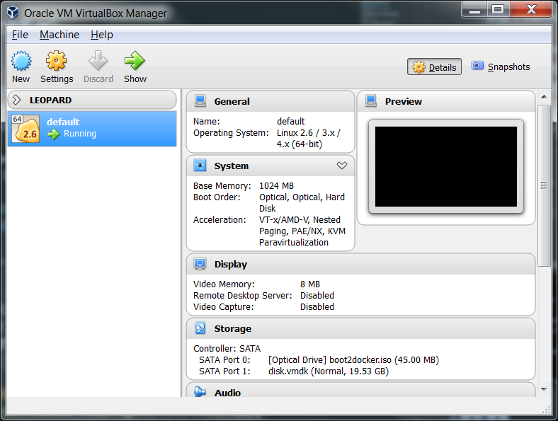
# docker指令
日常主要使用`镜像`、`容器`这两类指令。       

官方文档地址：[https://docs.docker.com/engine/reference/run/](https://docs.docker.com/engine/reference/run/)       

下面我们以`spring boot`的官方docker例子来对docker指令做个演示。     

1.**查询镜像**      
`$ docker search docker_image_name`
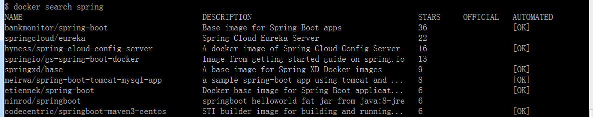

2.**获取镜像**      
 `$ docker pull docker_image_name:version`     
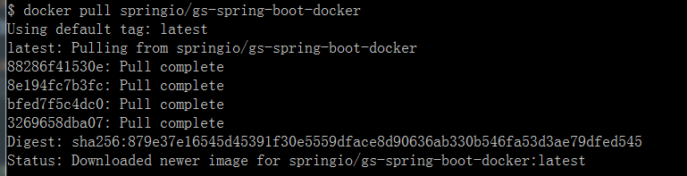

**查看镜像列表**      
`$ docker images`     
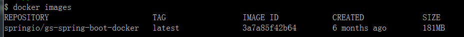

3.**用镜像新建一个容器并且运行容器**       
`$ docker run -it -p 8080:8080 docker_image_name/docker_image_id`     
常用参数说明：       
-d 让容器在后台运行     
-i 在新容器内指定一个伪终端或终端      
-t 允许你对容器内的标准输入 (STDIN) 进行交互        
-p 将容器内部使用的网络端口映射到我们使用的主机上
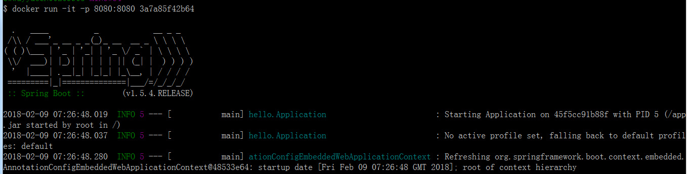
注意docker的默认地址是`192.168.99.100`，访问这个地址的`8080`端口，可以看见运行结果：      
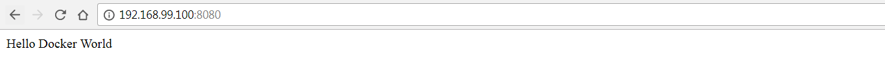       

如果容器已经通过`docker run`新建并运行过了，下次要再启动，只需使用`docker start`。

4.**查看容器**      
`$ docker ps -a`     
运行`docker run -d 3a7a85f42b64`再创建一个在后台运行的容器，然后运行`docker ps -a`查看所有的容器。      
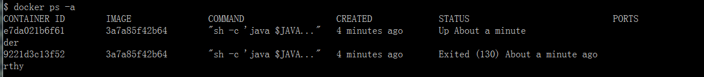

5.**进入运行中的容器**      
`$ docker exec -it [container id] /bin/sh`       
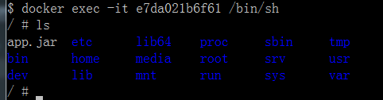 

6.**查看镜像或者容器信息**
```
$ docker inspect  [ imageID | imageName | containerId | containerName ]
```        
用`-f`查看指定的参数：`docker inspect -f "{{.Config.Cmd}} {{.ContainerConfig.Volumes}} ({{.Id}})" imageID/imageName`     
或查看全部的：
```
docker inspect $(docker images -a -q) 
docker inspect $(docker ps -a -q)
```
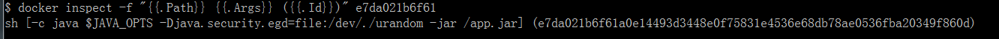

7.**ssh登录docker-machine**
有时候我们需要进入`docker machine`,比如了解数据是以什么形式存储的在容器外部的，可以通过下面命令进入。
```
$ docker-machine ssh machinename
```


其他指令，在这里就不再描述了，请在需要用到时查阅官方文档即可。

# docker镜像创建
docker镜像可以通过两种方式来创建。        
- 一种是在利用`docker exec`指令进入运行的容器，对容器进行修改后，通过`docker commit`指令，将修改过的容器提交成一个新的镜像。     
- 另一种是使用`Dockerfile`脚本，用`docker build`指令构建。   
## Dockerfile介绍
Dockerfile是由Dockerfile指令编写的一个脚本文件，可以通过Dockfile指令指定docker的基础镜像，将打包docker镜像需要的资源文件复制到docker镜像，指定docker容器运行时执行的命令等等。       

**官方文档地址**：[Dockerfile reference](https://docs.docker.com/engine/reference/builder/)
### Dockerfile指令简介
指令名称     | 作用     
------      |  -------  
RUN         | 执行Linux命令
COPY        | 复制文件
ADD         | 更高级的复制文件，会自动解压复制的文件，推荐需要自动解压缩的场合使用ADD 
CMD         | 容器启动命令        
ENTRYPOINT  | 入口点，默认为`/bin/sh -c`
ENV         | 设置环境变量
USER	    | 指定当前用户
WORKDIR	    | 指定工作目录
EXPOSE	    | 声明端口
VOLUME	    | 定义匿名卷     

CMD和ENTRYPOINT的区别：ENTRYPOINT指定一个容器启动的时候始终会执行的命令，而CMD则指定对ENTRYPOINT的补充参数。      
**官方解释**：[Understand how CMD and ENTRYPOINT interact](https://docs.docker.com/engine/reference/builder/#understand-how-cmd-and-entrypoint-interact)
### Dockerfile构建spring应用镜像
1.在spring工程根目录下创建Dockerfile文件。
```
FROM tomcat:8
ADD target/spring_demo.war /usr/local/tomcat/webapps/
CMD ["catalina.sh", "run"]
```
2.运行maven对工程进行打包，打包完成后，运行docker build命令：
```
$ docker build -t spring_demo .
```
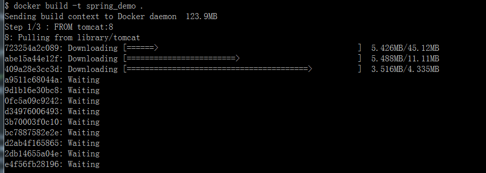
docker打包成功,从体积上可以看出，spring_demo比基础镜像tomcat大了54M，差不多就是war包的体积大小。      
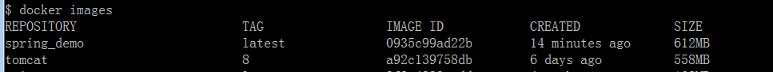
通过下面命令运行
```
$ docker run -d -p 8080:8080 spring_demo
```
### Dockerfile构建spring boot应用镜像
1.在spring boot 工程根目录下，创建Dockerfile文件。
内容如下：

```
FROM frolvlad/alpine-oraclejdk8:slim
VOLUME /tmp
ADD target/yourPackage.jar app.jar
ENV JAVA_OPTS=""
ENTRYPOINT [ "sh", "-c", "java $JAVA_OPTS -Djava.security.egd=file:/dev/./urandom -jar /app.jar" ]
```
其中`yourPackage.jar`是spring boot工程经过maven插件`spring-boot-maven-plugin`打包后生成的jar包名。

2.maven打包之后，运行`docker build`命令构建镜像    
运行docker terminal,cd到工程根目录，如cd /C/Projects/mySpringServer/,运行：
```
$ docker build -t companyName/yourImageName:versionNumber .
```
如果没有提示错误，则成功创建了一个名字为`companyName/yourImageName`,版本为`versionNumber`的本地镜像。
可以通过`docker images`命令查看该镜像是否在镜像列表里面。

3.docker run命令运行
```
$ docker run -e "SPRING_PROFILES_ACTIVE=dev" -p 8081:8081 -t companyName/yourImageName:versionNumber
```
其中`8081：8081`，第一个端口指的是应用在docker运行的端口，第二个端口指的是docker映射到宿主机上的端口。

## 结合Maven生命周期构建docker镜像  
Maven插件：[dockerfile-maven](https://github.com/spotify/dockerfile-maven)     
效果：maven package的时候build docker镜像，maven deploy的时候，推送docker镜像到远程docker仓库。

# docker仓库
官方文档：[Docker Registry](https://docs.docker.com/registry/)       
docker registry是一个无状态的、高度可伸缩的服务器端应用程序，可以存储并允许您发布Docker映像。docker官方开源了docker registry,我们可以用官方的docker registry搭建docker私有仓库服务。      

**拉取registry镜像并且运行**        
```
$ docker run -d -p 5000:5000 registry
```
**对镜像进行标记，让镜像指向这个私库。**
```
$ docker tag spring_demo localhost:5000/spring_demo
```
**推送镜像到这个私库**
```
$ docker push localhost:5000/spring_demo
```
这个时候，我们进入registry容器，可以看到刚刚上传的spring_demo在`var/lib/registry/docker/registry/v2/repositories/spring_demo`这个位置      

**从私库把刚才上传的拉回来**
```
$ docker pull localhost:5000/spring_demo
```
**停止私库并且清除所有数据**
```
$ docker stop registry && docker rm -v registry
```
# docker数据管理
  
默认情况下，docker容器的数据的存储是在容器内部的，但是数据存储在容器内部不方便管理，并且容器删除之后，数据会消失，而且别的应用也无法读取到容器内部的数据，不利于数据共享。        

docker提供了三种方式管理数据：`volumes(数据卷)`、`bind mounts(绑定挂载点)`以及`tmpfs mounts(临时内存挂载)`。      
[官方文档：数据管理](https://docs.docker.com/engine/admin/volumes/)  

      

下面的例子都是在windows下进行的。

## volumes
volumes是完全由docker管理的数据持久区域，独立于container之外，并且同一个volume可以在多个container之间共享,甚至可以远程共享。如果是在windows或者MAC，创建的volumes位于`/var/lib/docker/volumes`目录。      

**volume创建和查看**
```
$ docker volume create my-vol   //创建一个名为my-vol的volume
my-vol
$ docker volume ls              //查看volume列表
DRIVER              VOLUME NAME
local               3f81a484d4d0db1eae04ed4933ce2f8812b9de4935607b2e68d3529edb91f33e
local               my-vol
$ docker-machine ssh default    //进入docker machine
$ sudo ls /var/lib/docker/volumes  //新建的volume就在这个目录
3f81a484d4d0db1eae04ed4933ce2f8812b9de4935607b2e68d3529edb91f33e
metadata.db
my-vol
```
**启动容器时挂载数据卷**      
```
$ docker run -d --mount type=volume,src=my-vol,target=/temp spring_demo
```
用`docker inspect`查看刚才新建的container信息，会看到`Mounts`节点已经有volume的挂载信息。
```
        "Mounts": [
            {
                "Type": "volume",
                "Name": "my-vol",
                "Source": "/mnt/sda1/var/lib/docker/volumes/my-vol/_data",
                "Destination": "/temp",
                "Driver": "local",
                "Mode": "z",
                "RW": true,
                "Propagation": ""
            }
        ],
```
挂载成功之后，如果进入`default`这个docker machine里面的`/var/lib/docker/volumes/my-vol/_data`目录新建一个名为`test.txt`的文件，然后再进入刚才挂载了`my-vol`的`spring_demo`容器的`/temp`目录，就会看到这个文件。

## bind mounts
`bind mounts`是将宿主机的文件或者目录挂载到docker容器某个目录。       
值得注意的是，如果是在windows或者Mac，则只能挂载Users目录下面的内容（windows是C:\Users，Mac是 /Users）

**启动容器时绑定挂载点**    
```
$ docker run -d --mount type=bind,src='/c/Users/yourUserName/testMount',target='/temp' spring_demo
```
`docker inspect`结果：
```
        "Mounts": [
            {
                "Type": "bind",
                "Source": "/c/Users/yourUserName/testMount",
                "Destination": "/temp",
                "Mode": "",
                "RW": true,
                "Propagation": "rprivate"
            }
        ],
```
如果在宿主机的`/c/Users/yourUserName/testMount`目录新建一个`test.txt`文件，那么在该容器的`/temp`就能看到。

**tmpfs mounts**
docker还提供了基于内存的临时文件系统，来进行非持久化的数据的存储。但是这个功能个人感觉没什么用，应该一般都会采用分布式缓存之类的来代替。


# 参考文档
- [Docker — 从入门到实践（中文gitbook)](https://yeasy.gitbooks.io/docker_practice/introduction/)
- [官方：Docker命令参考](https://docs.docker.com/engine/reference/run/)
- [官方：Dockerfile参考](https://docs.docker.com/engine/reference/builder/)      
- [官方：Docker仓库](https://docs.docker.com/registry/)    
- [官方：数据管理](https://docs.docker.com/engine/admin/volumes/)   
- [docker容器与虚拟机有什么区别？](https://www.zhihu.com/question/48174633)
- [docker多个容器运行时实际占用大小](https://github.com/docker/docker.github.io/issues/1520#issuecomment-305179362)