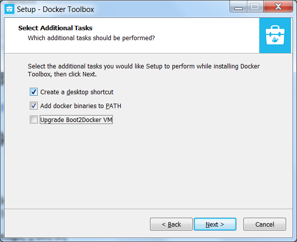
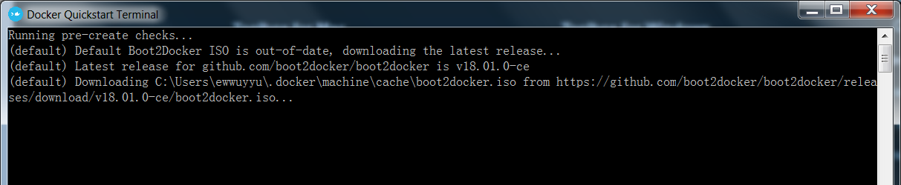

# Linux安装
## ubuntu
1. 安装

```
root@ghostcloud:~# apt-get install docker-engine
```

2. 启动docker daemon

```
root@ghostcloud:~# service docker start
```

3. 测试安装是否成功

```
root@ghostcloud:~# docker version
```


## centos 
yum install docker安装的不是最新的版本，
要安装最新的，可参考文档：
https://www.digitalocean.com/community/tutorials/how-to-install-and-use-docker-on-centos-7         
简单的步骤如下

But first, let's update the package database:       

```
sudo yum check-update
```


Now run this command. It will add the official Docker repository, download the latest version of Docker, and install it:     
 
```
curl -fsSL https://get.docker.com/ | sh
```


After installation has completed, start the Docker daemon:      
 
```
sudo systemctl start docker
```


Verify that it's running:       
 
```
sudo systemctl status docker
```


# windows安装
需要注意的是，windows根据系统有两种安装方式：
- Windows 10以下需要安装docker-toolbox        
- Windows 10以上需要安装Docker for Windows            

这里只介绍docker-toolbox的安装方法
### 安装docker-toolbox
由于官网下载会比较慢，可以到到阿里云下载最新的docker-toolbox        
http://mirrors.aliyun.com/docker-toolbox/windows/docker-toolbox/  

如果在安装的时候没有翻墙，请去掉`Upgrade Boot2Docker VM`这个选项的勾选。
      

安装完成之后，运行`Docker Quickstart Terminal`工具，会进行一个名为`default`的docker machine的创建，但是在国内如果没翻墙，会遇到无法成功下载最新的`boot2docker.iso`导致创建docker machine失败的问题。

可以在首次运行`Docker Quickstart Terminal`时翻墙，或者下面介绍的手动下载最新`boot2docker.iso`到本地目录的方法来解决。

### 下载boot2docker.iso到本地cache目录
docker在windows是基于一个最小Linux系统镜像运行的，这个包含在boot2docker.iso里面。
https://github.com/boot2docker/boot2docker/releases     
放到本地的下面这个目录下，创建docker Machine会用到。      
[%USERPROFILE%/.docker/machine/cache](%USERPROFILE%/.docker/machine/cache)        
### 创建配置阿里云镜像加速器的虚拟机   
在国内，拉取docker官方镜像的速度比较慢，我们可以通过配置`阿里云镜像加速器`来解决这个问题。     

首先，到[镜像加速器](https://cr.console.aliyun.com/?#/accelerator)获取自己的专属阿里云镜像加速器地址。

然后运行cmd，创建一台安装有Docker环境的Linux虚拟机，指定机器名称为default，同时配置Docker加速器地址。        
```
docker-machine create --engine-registry-mirror=https://<你自己的阿里云镜像加速器地址> -d virtualbox default
```
如果已经存在了`default`这个名字的docker machine，可以`rm`指令删除。
```
docker-machine rm default
```
查看机器的环境配置，并配置到本地，并通过Docker客户端访问Docker服务。
```
docker-machine env default
eval "$(docker-machine env default)"
docker info
```

经过这两个步骤，就完成了docker和docker Machine的配置和创建。    

运行`Docker Quickstart Terminal`工具，就可以运行docker的指令进行操作了。